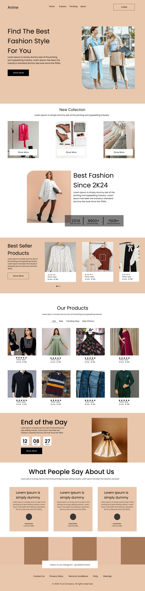

<h1 align="center">
  🚀 My Projects
   
  
  
</h1>

  A growing collection of fun, experimental, and useful projects — from web to scripts to data!

## 🧩 Featured Categories

<pre>
🧠 Python Scripts      →  Automation, bots, CLI tools
🕸️ Web Projects        →  HTML/CSS/JS projects, UI/UX, mini-apps
📈 Data Projects       →  Visualizations, ML, analytics
🔬 Experiments         →  Tryouts, frameworks, tests
</pre>

---

## 🌌 3D-Style Preview (Concept)

> _Want it to really pop?_ Add project screenshots, diagrams, or even 3D mockups here:

_Replace the image URL with your own screenshots or GIFs._

---
welocome to my projects
